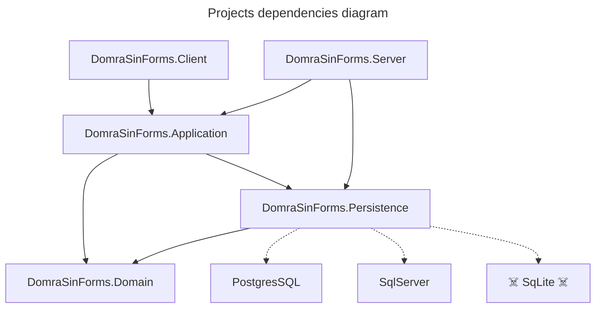

# DomraSinForms

## System Design

`DomraSinForms.Domain` is base project that contains only models and abstractions.

`DomraSinForms.Client` - Blazor Server application that use `DomraSinForms.Application` as its own logic provider (except UI logic). It also provides Repositories realization by adding `DomraSinForms.Persistance` to DI container.
