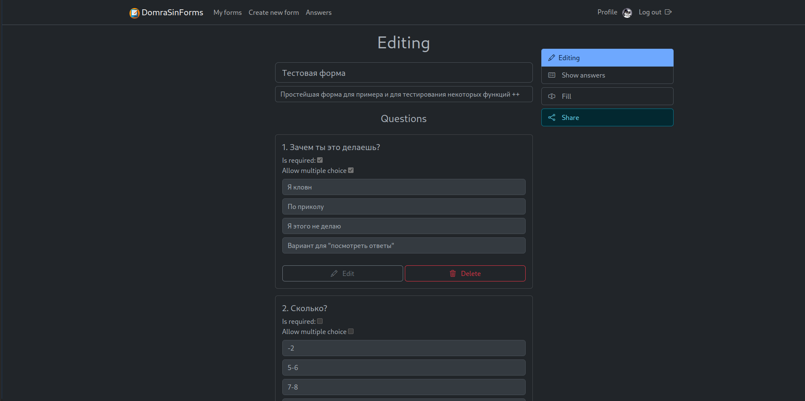
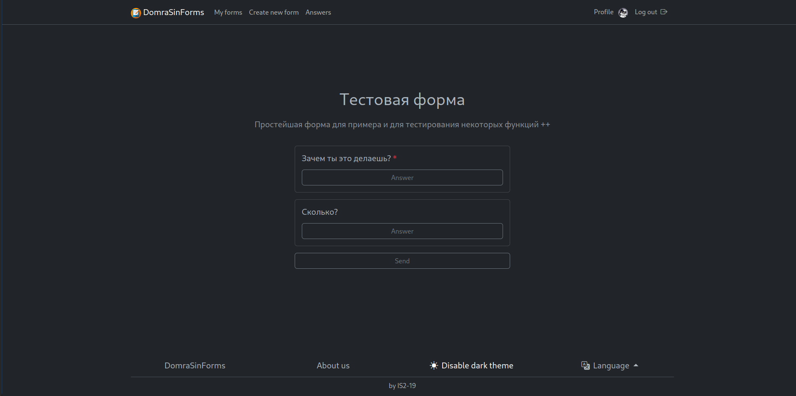
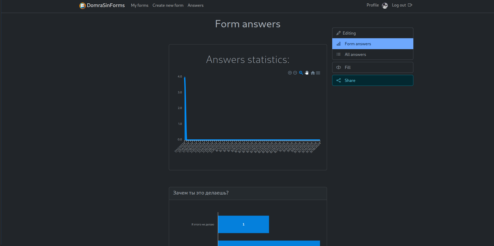

# DomraSinForms

_Simple web app for creating surveys, forms etc._

**Features:**

- Form/surveys
- Statistics
- Light/dark modes
- Localization (currently: English, Russian and Armenian)
- Completely free and open source

## Screenshots

- Editing page

- Fill page

- Statistics page

## TODO

- [ ] Finnish caching
- [ ] Move to blazor
- [ ] Add used libs to Readme

_Feel free to contribute_

## Project status

Currently, **DSF** isn't in active development, but any bugs will be fixed as soon as possible.
